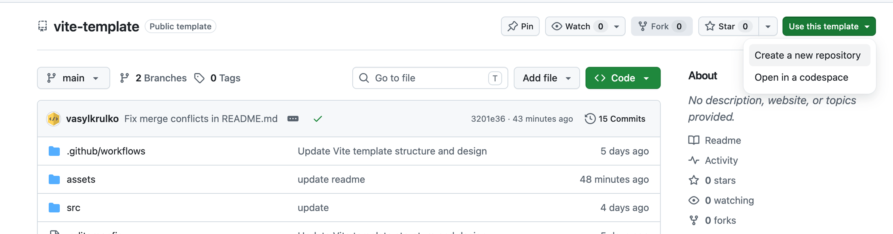
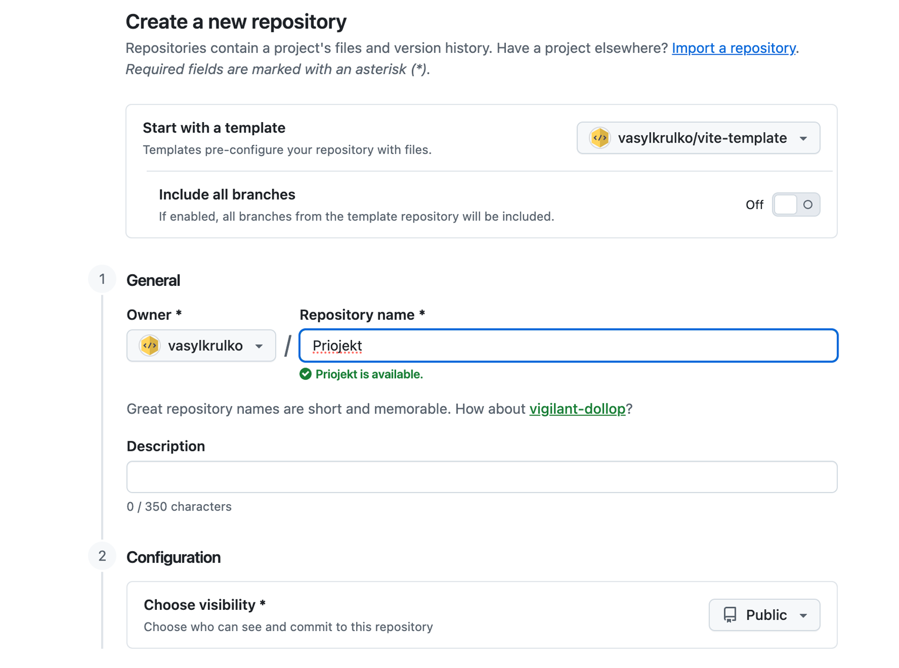
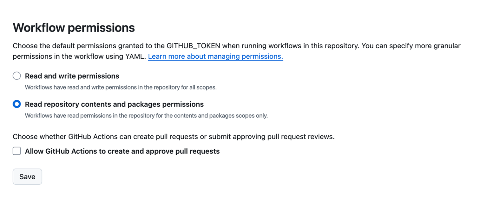
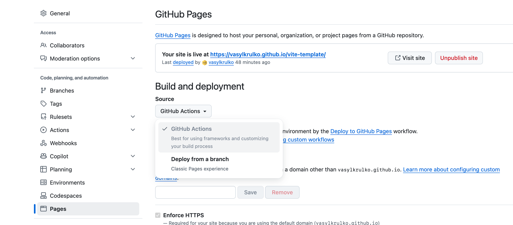
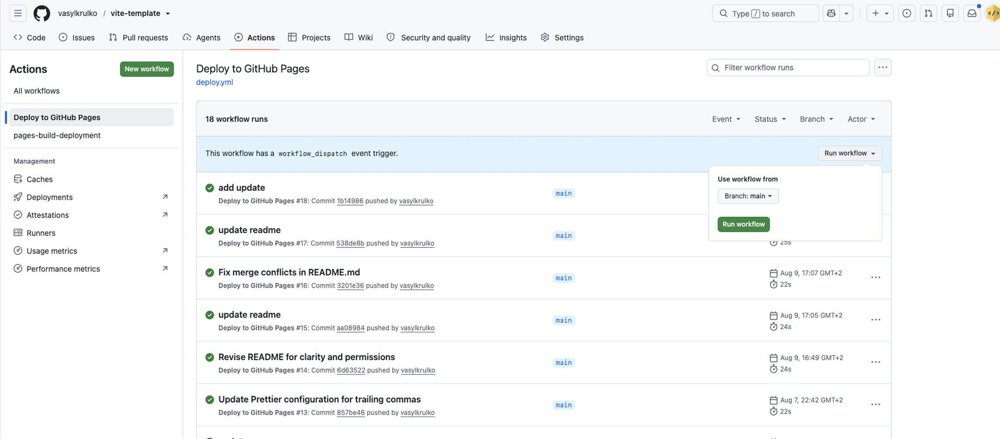

# Vite Template

Цей проект було створено за допомогою Vite. Для знайомства та налаштування
додаткових можливостей [звернись до документації](https://vitejs.dev/).

## Створення репозиторію за шаблоном

Використовуй цей репозиторій як шаблон для створення репозиторію свого проекту.
Для цього натисни на кнопку `«Use this template»` і обери опцію
`«Create a new repository»`, як показано на зображенні.



На наступному етапі відкриється сторінка створення нового репозиторію. Заповни
поле його імені, переконайся, що репозиторій публічний, після чого натисни
кнопку `«Create repository from template»`.



Після того, як репозиторій буде створено, необхідно перейти в налаштування
створеного репозиторію на вкладку `Settings` > `Actions` > `General` як показано
на зображенні.


Проскроливши сторінку до самого кінця, в секції `«Workflow permissions»` залиш
опцію `«Read repository contents and packages permissions»`.

Опцію `«Read and write permissions»` вмикати не потрібно.

Чекбокс `«Allow GitHub Actions to create and approve pull requests»` також залиш
вимкненим.

Необхідні дозволи для автоматичного деплою GitHub Pages вже явно задані у файлі
`.github/workflows/deploy.yml`.



Тепер у тебе є особистий репозиторій проекту, зі структурою файлів та папок
репозиторію-шаблону. Далі працюй з ним, як з будь-яким іншим особистим
репозиторієм, клонуй його собі на комп'ютер, пиши код, створюй гілки, роби
коміти та відправляй їх на GitHub.

## Підготовка до роботи

1. Переконайся, що на комп'ютері встановлено LTS-версію Node.js.
   [Скачай та встанови](https://nodejs.org/en/) її якщо необхідно.
2. Встанови базові залежності проекту в терміналі командою `npm install`.
3. Запусти режим розробки, виконавши в терміналі команду `npm run dev`.
4. Перейди у браузері за адресою [http://localhost:5173](http://localhost:5173).
   Ця сторінка буде автоматично перезавантажуватись після збереження змін у
   файли проекту.

## Файли і папки

- Файли розмітки компонентів сторінки повинні лежати в папці `src/partials` та
  імпортуватись до файлу `index.html`. Наприклад, файл з розміткою хедера
  `header.html` створюємо у папці `partials` та імпортуємо в `index.html`.
- Файли стилів повинні лежати в папці `src/css` та імпортуватись до HTML-файлів
  сторінок. Наприклад, для `index.html` файл стилів називається `index.css`.
- Зображення додавай до папки `src/img`. Збирач оптимізує їх, але тільки при
  деплої продакшн версії проекту. Все це відбувається у хмарі, щоб не
  навантажувати твій комп'ютер, тому що на слабких компʼютерах це може зайняти
  багато часу.

## Деплой

Продакшн версія проекту буде автоматично збиратися та деплоїтись на GitHub Pages
щоразу, коли оновлюється гілка `main`. Наприклад, після прямого пуша або
прийнятого pull request.

Для деплою використовується GitHub Actions workflow із файлу
`.github/workflows/deploy.yml`.

У налаштуваннях GitHub-репозиторію необхідно виконати наступні кроки:

1. Перейти в `Settings` > `Pages` та переконатися, що в секції
   `Build and deployment` як джерело вибрано `GitHub Actions`.



2. Перейти у вкладку `Actions`:
   - У лівій колонці обрати **Deploy to GitHub Pages**.
   - Натиснути кнопку **Run workflow** -> перевірити гілку `main` -> натиснути
     зелену кнопку **Run workflow**.



Шлях для GitHub Pages визначається автоматично під час команди:

```bash
npm run build:github
```
